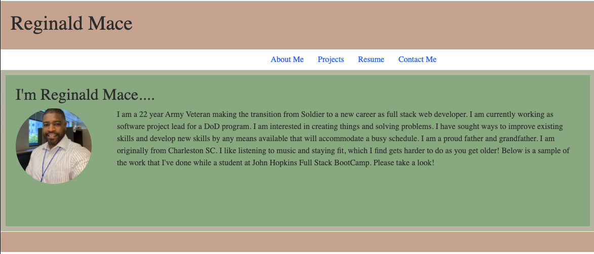
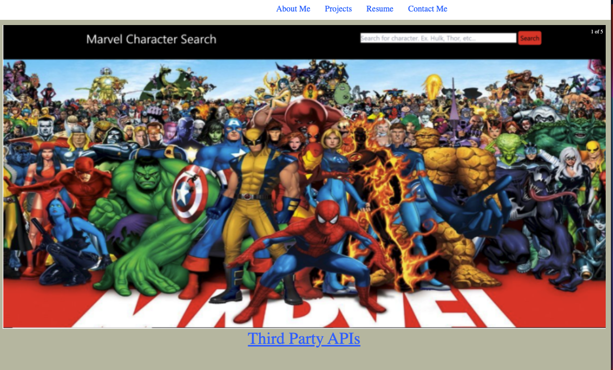
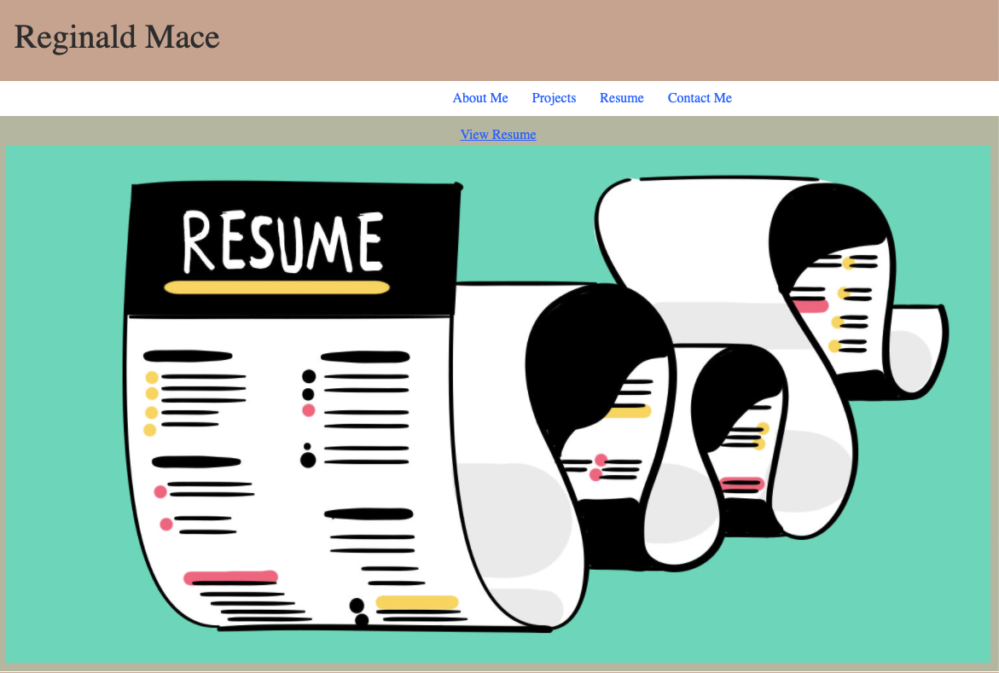

# react portfolio

## description

This is a portfolio created using node.js and using react to create a single page application.

## Usage

## License

This application is covered under the MIT license. To learn more about the the MIT license, click on .

## Questions

Please send any questions about this application to me at:
[GitHub/reggiemace](https://github.com/reggiemace)

For additional questions regarding this project, feel free to contact me at:
reginaldmace36@gmail.com
